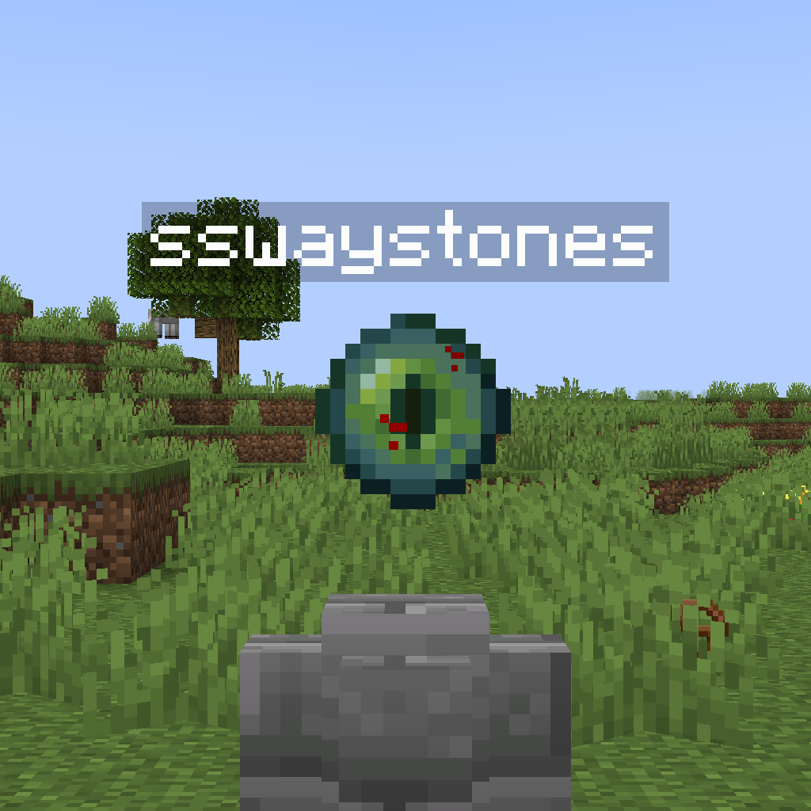
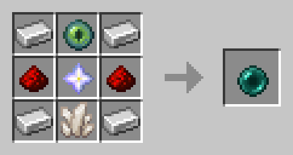

# Server-Side Waystones (sswaystones)

Polymer-based server sided Waystone mod, with Geyser and vanilla client support. (inspired by the now-archived [Wraith Waystones Polymer Port](https://modrinth.com/mod/polymer-ports-waystones))

## Features
- Server-side Waystone blocks that allow you to teleport long distances and across dimensions.
- Feature-full GUIs for both Bedrock and Java players, using forms and chest GUIs respectively.
- Waystones can have up to 32 character long names and can be set to "global" to allow for anybody on the server to use them.
- The mod works on both servers and singleplayer worlds, and all storage data is held in the world itself.

## Recipes
*Recipe for the Waystone*

*Recipe for the Portable Waystone*

## Roadmap
- [ ] Add optional XP price for teleporting.
- [ ] More configuration
- [ ] More items (~~Portable Waystone~~, Scrolls, etc.)